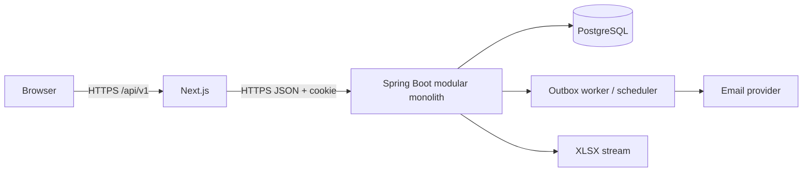
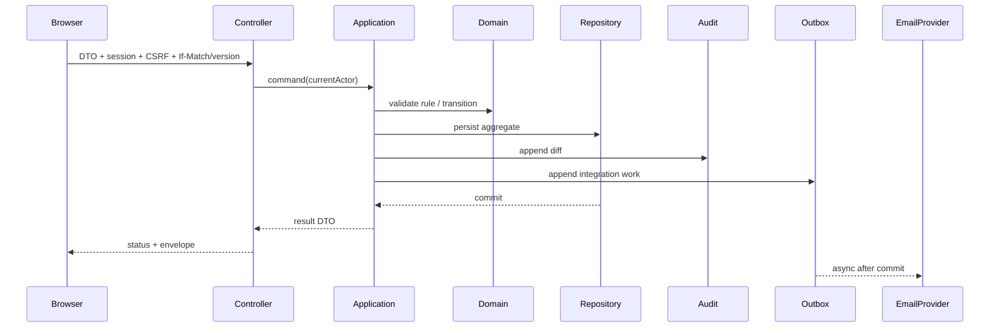

# Software Architecture Document

## 1. Mục tiêu và quyết định

MVP dùng **modular monolith**: Next.js/TypeScript frontend, Java 21 + Spring Boot backend và PostgreSQL. Kiến trúc ưu tiên transaction rõ, triển khai rẻ, module có biên giới để tách service sau này nếu thật sự cần.

Stack này đã được hiện thực hóa xuyên suốt Phase 0–12. Authentication dùng opaque server-side session trong secure cookie; production cưỡng chế prefix `__Host-`. Lý do và controls ở [security-design.md](security-design.md).



## 2. Context và quality goals

Hệ thống phục vụ một trường, hai SystemRole, tải vừa phải. Quality goals: bảo mật DRAFT/dữ liệu cá nhân; tính nhất quán publish/audit/outbox; khả năng truy vết; UX editor rõ; phục hồi DB; mở rộng PersonalCalendar/Search mà không phá domain.

Không dùng Kubernetes, microservices, Kafka hoặc WebSocket trong MVP.

## 3. Frontend architecture

Next.js App Router tổ chức theo feature: `auth`, `admin/users`, `organization`, `academic`, `weekly-plan`, `tasks`, `notifications`, `reminders`, `conversations`, `audit`, `shared`. Server layout kiểm tra session để điều hướng; backend vẫn là enforcement point.

- TanStack Query quản lý server state/cache/invalidation; không lưu plan đầy đủ trong global client store.
- React Hook Form + Zod validate UX; schema backend là thẩm quyền cuối.
- WeeklyPlan editor dùng block components: header, 5 AssignmentCard, DutyClassPicker, 7 day cards với 2 SessionBlock và EventCard.
- Autosave nếu triển khai phải gửi `version`; conflict `409` hiển thị reload/merge, không silently overwrite.
- UI chỉ hiển thị lỗi an toàn với correlation ID; không render raw HTML từ content.

## 4. Backend modules và dependency rule

```text
com.school.schedule
├── auth
├── user
├── organization
├── academic
├── weeklyplan
├── task
├── notification
├── reminder
├── conversation
├── audit
├── export
└── shared
```

Mỗi feature có `api` (controller/DTO), `application` (use-case service/port), `domain` (entity/rule), `infrastructure` (JPA/provider adapter). Controller không gọi repository trực tiếp. Domain không phụ thuộc Spring/JPA nếu thực tế hợp lý; application phụ thuộc port, infrastructure implement port.

`shared` chỉ chứa primitive thực sự dùng chung: error envelope, clock, ID, pagination, transaction/outbox abstractions. `shared` không phụ thuộc feature. Giao tiếp chéo module qua application facade hoặc domain event/outbox; cấm truy cập repository của module khác.

| Module | Trách nhiệm | Phụ thuộc được phép |
|---|---|---|
| auth | credentials, session, reset token, CSRF | user facade, shared |
| user | User lifecycle/profile | organization read facade, audit |
| organization | Department, BusinessRole, SchoolClass | academic read facade, audit |
| academic | AcademicYear, SchoolWeek | audit |
| weeklyplan | plan/sections/targets/sessions/Event/duty/publish | academic + organization read ports, notification port, audit |
| task | Task lifecycle/summary | weeklyplan/user read ports, notification, audit |
| notification | center, recipients, outbox email | user read port, shared |
| reminder | Event reminder + scheduled jobs | weeklyplan read port, notification email port, audit |
| conversation | threads/messages/close | user, notification, audit |
| export | read-only plan projection -> XLSX | weeklyplan query port, audit |
| audit | append/query redacted AuditLog | shared |

## 5. Layers và request flow



- API layer: parse/Bean Validation, authorization annotation, mapping.
- Application: transaction boundary, orchestration, ownership checks, idempotency.
- Domain: invariants/status transition/derived value.
- Persistence: JPA mappings, query projections, locking/index-aware access.

## 6. Domain aggregates và transaction boundaries

- `WeeklyPlan` aggregate owns PlanSection, target, DaySession, Event and duty FKs. Full editor save is one transaction; Event endpoint also locks/checks plan version.
- `Task`, `Reminder`, `Conversation` (owning messages), `Notification` và `User` là aggregate riêng.
- Publish transaction updates plan, appends AuditLog, notification command/outbox. Recipient fan-out có thể chạy worker sau commit; event key duy nhất đảm bảo idempotency.
- Không gọi email provider trong DB transaction. Worker claim rows bằng `FOR UPDATE SKIP LOCKED`, lease timeout và retry/backoff.
- Optimistic locking (`version`) cho User, WeeklyPlan, Task, Conversation.

## 7. Notification, reminder và scheduler

Notification domain lưu nội dung immutable + recipient read tracking. Email dùng `outbox_messages`; trạng thái provider không lẫn với read status. Publish/duty/task/message tạo event có `deduplicationKey`.

Reminder worker chạy mỗi phút, claim due records. Saturday job dùng cron timezone cấu hình và `scheduler_job_runs(jobKey)` để một slot chỉ enqueue một lần kể cả nhiều instance. Trong MVP có thể chỉ chạy một backend instance; locking vẫn giữ để scale ngang.

## 8. Conversation, audit và export

Conversation là polling: list messages theo cursor `(createdAt,id)`; append-only. Close khóa status. Notification báo phía kia.

Audit nhận canonical JSON snapshot/diff đã redact, actor `USER_ID` hoặc `SYSTEM`. Audit cùng transaction với mutation; chỉ append/query. Payload lớn cần giới hạn kích thước và không chứa credential.

Export query snapshot read-only, map vào export view, Apache POI render `.xlsx` và stream response. Template/formatter là port để thêm mẫu trường, VBA-enabled template hoặc PDF sau MVP.

## 9. Authentication và authorization

Login tạo random opaque session, DB/Redis-like store ban đầu là PostgreSQL, cookie HttpOnly/Secure/SameSite. CSRF dùng synchronizer token. Security filter resolve actor; method-level policy `@PreAuthorize` kiểm SystemRole; service luôn kiểm ownership/resource visibility. USER query WeeklyPlan bắt buộc predicate `status=PUBLISHED`.

## 10. Error handling, logging và observability

`@RestControllerAdvice` map lỗi domain sang envelope chuẩn: validation 422, unauthenticated 401, forbidden 403, hidden resource 404, conflict 409, rate 429, unexpected 500. Không trả stack trace.

JSON logs có timestamp, level, service/version, correlation ID, actor ID (không email nếu không cần), route, latency, result. Metrics: request latency/error, DB pool, outbox backlog/failure, reminder lag, Saturday job last success, email provider outcome. `/actuator/health/liveness` không phụ thuộc external; readiness kiểm DB và migration.

## 11. Scalability và extension points

- Stateless web nodes ngoài session store; connection pool có giới hạn; pagination mọi collection.
- Read projection cho dashboard/Relevant To Me; index theo plan/status/target/recipient.
- Outbox cho tải email; không cần message broker hiện tại.
- PersonalCalendar phase 2 là module riêng tham chiếu User và dùng shared time interval; không nhồi vào Event.
- Search phase 2 dùng query port/read model, có thể PostgreSQL FTS trước search engine.
- Week shift là application command riêng với preview/confirm/audit.
- Multi-tenant không thuộc scope; nếu phát sinh cần ADR và thêm tenant key xuyên schema, không chỉ filter UI.

## 12. Quyết định cần ghi ADR

ADR-001 modular monolith; ADR-002 opaque cookie session; ADR-003 transactional outbox; ADR-004 SchoolClass thuộc AcademicYear; ADR-005 audit cùng transaction. Các **OPEN QUESTION** về provider email, retention, MFA và mẫu Excel phải được chốt trước production.

## 13. Implementation baseline (2026-08-19)

Backend dùng Spring Boot 4.1.0, Java release 21, Maven Wrapper và cấu trúc package gốc `vn.edu.school.schedule`. `shared` cung cấp API envelope, validation error mapping, correlation ID và security deny-by-default; toàn bộ module nghiệp vụ Phase 1–11 đã tích hợp PostgreSQL. ArchUnit kiểm soát chiều phụ thuộc `shared <- feature`.

Frontend Next.js đã tích hợp toàn bộ vertical slice qua REST adapter và DTO mapper; runtime `src` không còn import mock. Browser E2E chạy trên production image qua backend/PostgreSQL thật.
# Phase 1 implementation alignment

Authentication và user approval được triển khai thành feature packages `auth` và `user`; web security/filter dùng port `SessionAuthenticator` trong `shared` để giữ chiều phụ thuộc `shared <- feature`. Persistence Phase 1 dùng `JdbcTemplate`/transaction trực tiếp trên schema Flyway đã chốt, tránh tạo model ORM song song với baseline. Frontend giữ domain view model, còn REST envelope/CSRF và DTO mapping nằm ở service boundary.

# Phase 2 implementation alignment

Organization được triển khai trong package `organization` theo Controller → Service → `JdbcTemplate`, dùng transaction cho mutation và AuditLog. Flyway V2 thêm optimistic version cho Department, BusinessRole và SchoolClass. Frontend các trang quản trị tương ứng dùng REST service/DTO mapper; AcademicYear CRUD thuộc module `academic` từ Phase 3.

# Phase 3 implementation alignment

Academic calendar được triển khai trong package `academic` theo Controller → Service → `JdbcTemplate`. Tạo năm + generator chạy trong một transaction; advisory lock tuần tự hóa create/activate để giữ tối đa một năm active. SchoolWeek giữ `sequenceNumber` bất biến, dùng optimistic version và tính overlap warning ở read projection. Flyway V3 thêm version cho AcademicYear; `/admin/academic-years` và WeeklyPlan selector đều dùng REST service.

# Phase 4 implementation alignment

WeeklyPlan DRAFT được triển khai trong package `weeklyplan` theo Controller → Service → `JdbcTemplate`; create, copy và full-save aggregate đều là transaction có AuditLog. Create sinh cấu trúc 5 section và 2 session/ngày theo khoảng ngày của SchoolWeek. Copy dùng advisory lock cùng bảng idempotency Flyway V4, ánh xạ ngày/buổi theo ordinal và chủ động loại Event, Task, Reminder, Notification, lớp trực. Backend che DRAFT khỏi User bằng 404. Frontend `/admin/weekly-plans` và editor đã chuyển sang REST; Event, validation/publish và màn hình kế hoạch dành cho User được giữ đúng phạm vi Phase 5.
