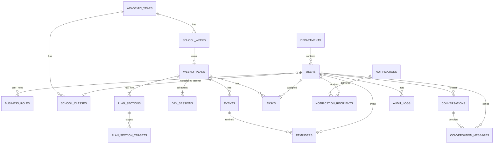

# Thiết kế cơ sở dữ liệu

PostgreSQL 16+, snake_case vật lý, UUID ứng dụng sinh, `timestamptz` UTC, UI chuyển timezone trường. Mọi bảng mutable có `created_at`, `updated_at`; các cột đó được lược khỏi bảng mô tả khi không cần giải thích. Enum triển khai bằng `varchar` + CHECK để migration dễ kiểm soát.

## 1. ER diagram

## 2. Identity và tổ chức

### `departments`

| Column | Type | Null/default/key | Mô tả |
|---|---|---|---|
| id | uuid | PK | Department ID |
| name | varchar(150) | NOT NULL | Tên hiển thị |
| normalized_name | varchar(150) | NOT NULL UNIQUE | So trùng không phân biệt hoa/khoảng trắng |
| description | text | NULL | Mô tả |
| is_active | boolean | NOT NULL default true | Soft deactivate |
| version | bigint | NOT NULL default 0 | Optimistic lock |
| created_at, updated_at | timestamptz | NOT NULL | Audit timestamps |

### `users`

| Column | Type | Null/default/key | Mô tả |
|---|---|---|---|
| id | uuid | PK | User ID |
| email | varchar(320) | NOT NULL | Email gốc đã trim |
| normalized_email | varchar(320) | NOT NULL UNIQUE | Lookup đăng nhập |
| password_hash | varchar(255) | NOT NULL | Argon2id/bcrypt hash |
| display_name | varchar(150) | NOT NULL | Tên hiển thị |
| system_role | varchar(20) | NOT NULL CHECK ADMIN/USER | SystemRole |
| status | varchar(20) | NOT NULL default PENDING CHECK | PENDING/ACTIVE/INACTIVE |
| department_id | uuid | NULL FK departments RESTRICT | Bắt buộc ở application khi ACTIVE |
| approved_by | uuid | NULL FK users SET NULL | Admin duyệt |
| approved_at | timestamptz | NULL | Thời điểm duyệt |
| version | bigint | NOT NULL default 0 | Optimistic lock |
| created_at, updated_at | timestamptz | NOT NULL | Timestamps |

Migration V6 dùng hai `admin_slot` duy nhất (1 và 2), CHECK constraint và trigger cấp slot có advisory lock để cho phép tối đa hai `ADMIN` active, kể cả khi tạo đồng thời.

### `business_roles` và `user_roles`

| Table.Column | Type | Null/default/key | Mô tả |
|---|---|---|---|
| business_roles.id | uuid | PK | BusinessRole ID |
| business_roles.name | varchar(150) | NOT NULL | Tên |
| business_roles.normalized_name | varchar(150) | UNIQUE NOT NULL | Unique normalized |
| business_roles.description | text | NULL | Mô tả |
| business_roles.is_protected | boolean | default false NOT NULL | Role seed quan trọng |
| business_roles.is_active | boolean | default true NOT NULL | Deactivate |
| business_roles.version | bigint | default 0 NOT NULL | Optimistic lock |
| user_roles.user_id | uuid | PK part, FK users CASCADE | Chỉ cascade join row, không xóa User nghiệp vụ |
| user_roles.business_role_id | uuid | PK part, FK business_roles RESTRICT | Không xóa role đang gán |
| user_roles.created_at | timestamptz | NOT NULL | Ngày gán |

### `school_classes`

| Column | Type | Null/default/key | Mô tả |
|---|---|---|---|
| id | uuid | PK | SchoolClass ID |
| academic_year_id | uuid | NOT NULL FK academic_years RESTRICT | Theo ASSUMPTION-03 |
| name | varchar(50) | NOT NULL | Ví dụ 11B5 |
| normalized_name | varchar(50) | NOT NULL | Unique cùng năm |
| grade | smallint | NOT NULL CHECK 10..12 | Khối |
| homeroom_teacher_id | uuid | NULL FK users SET NULL | GVCN |
| is_active | boolean | NOT NULL default true | Trạng thái |
| version | bigint | NOT NULL default 0 | Optimistic lock |
| created_at, updated_at | timestamptz | NOT NULL | Timestamps |

Unique `(academic_year_id, normalized_name)`; partial unique `(homeroom_teacher_id) WHERE is_active AND homeroom_teacher_id IS NOT NULL`.

Flyway `V2__organization_optimistic_lock.sql` bổ sung ba cột `version` trên Department, BusinessRole và SchoolClass cùng các index phục vụ truy vấn danh sách active/name.

## 3. Năm, tuần và kế hoạch

### `academic_years`

| Column | Type | Null/default/key | Mô tả |
|---|---|---|---|
| id | uuid | PK | AcademicYear ID |
| name | varchar(20) | NOT NULL UNIQUE | Ví dụ 2026-2027 |
| start_date | date | NOT NULL | Điểm sinh tuần mặc định |
| is_active | boolean | NOT NULL default true | Năm hiện hành được application kiểm tối đa một |
| created_by | uuid | NOT NULL FK users RESTRICT | Admin |
| version | bigint | NOT NULL default 0 | Optimistic lock |
| created_at, updated_at | timestamptz | NOT NULL | Timestamps |

Flyway `V3__academic_year_optimistic_lock.sql` bổ sung `version` và index `(is_active,start_date DESC)`. Application dùng transaction + PostgreSQL advisory lock để bảo đảm tối đa một năm active khi create/activate.

### `school_weeks`

| Column | Type | Null/default/key | Mô tả |
|---|---|---|---|
| id | uuid | PK | Stable ID |
| academic_year_id | uuid | NOT NULL FK academic_years RESTRICT | Parent |
| sequence_number | smallint | NOT NULL CHECK >0 | Thứ tự nội bộ |
| display_number | smallint | NOT NULL CHECK >0 | Số hiển thị |
| week_type | varchar(20) | NOT NULL CHECK ORIENTATION/STUDY | Loại |
| start_date | date | NOT NULL | Ngày đầu |
| end_date | date | NOT NULL | Ngày cuối, CHECK start<=end |
| version | bigint | NOT NULL default 0 | Lock |
| created_at, updated_at | timestamptz | NOT NULL | Timestamps |

Unique `(academic_year_id, sequence_number)`; index `(start_date,end_date)`, `(academic_year_id,week_type,display_number)`.

### `weekly_plans`

| Column | Type | Null/default/key | Mô tả |
|---|---|---|---|
| id | uuid | PK | WeeklyPlan ID |
| school_week_id | uuid | NOT NULL UNIQUE FK school_weeks RESTRICT | 1:0..1 |
| status | varchar(20) | NOT NULL default DRAFT CHECK | DRAFT/PUBLISHED |
| morning_duty_class_id | uuid | NULL FK school_classes SET NULL | Trực sáng |
| afternoon_duty_class_id | uuid | NULL FK school_classes SET NULL | Trực chiều |
| published_at | timestamptz | NULL | Required iff PUBLISHED |
| published_by | uuid | NULL FK users SET NULL | Admin publish |
| version | bigint | NOT NULL default 0 | Optimistic lock |
| created_by | uuid | NOT NULL FK users RESTRICT | Admin tạo |
| created_at, updated_at | timestamptz | NOT NULL | Timestamps |

CHECK status/metadata tương ứng; index `(status, published_at)`.

### `plan_sections`

| Column | Type | Null/default/key | Mô tả |
|---|---|---|---|
| id | uuid | PK | PlanSection ID |
| weekly_plan_id | uuid | NOT NULL FK weekly_plans CASCADE | Owned child; cascade chỉ khi xóa draft lỗi/setup |
| section_type | varchar(40) | NOT NULL CHECK 5 values | SectionType chuẩn |
| content | text | NULL | Nội dung, empty tạo warning |
| display_order | smallint | NOT NULL CHECK 1..5 | Thứ tự |
| created_at, updated_at | timestamptz | NOT NULL | Timestamps |

Unique `(weekly_plan_id,section_type)` và `(weekly_plan_id,display_order)`. Exactly-five được application validation; deferred constraint trigger là tùy chọn vì insert aggregate cần nhiều row.

### `plan_section_targets`

| Column | Type | Null/default/key | Mô tả |
|---|---|---|---|
| id | uuid | PK | Target ID |
| plan_section_id | uuid | NOT NULL FK plan_sections CASCADE | Owned child |
| target_type | varchar(20) | NOT NULL CHECK ALL/ROLE/DEPARTMENT/USER | Kiểu |
| business_role_id | uuid | NULL FK business_roles RESTRICT | Chỉ ROLE |
| department_id | uuid | NULL FK departments RESTRICT | Chỉ DEPARTMENT |
| user_id | uuid | NULL FK users RESTRICT | Chỉ USER |
| created_at | timestamptz | NOT NULL | Timestamp |

CHECK đúng 0 reference với ALL hoặc đúng 1 reference khớp type. Partial unique indexes cho từng `(plan_section_id, referenced_id)` và unique ALL per section. Index reverse trên mỗi FK phục vụ Relevant To Me.

### `day_sessions`

| Column | Type | Null/default/key | Mô tả |
|---|---|---|---|
| id | uuid | PK | DaySession ID |
| weekly_plan_id | uuid | NOT NULL FK weekly_plans CASCADE | Parent |
| session_date | date | NOT NULL | Phải nằm trong tuần (application) |
| session | varchar(20) | NOT NULL CHECK MORNING/AFTERNOON | Buổi |
| base_content | text | NULL | Nội dung nền, không phải Event |
| created_at, updated_at | timestamptz | NOT NULL | Timestamps |

Unique `(weekly_plan_id,session_date,session)`; index `(weekly_plan_id,session_date)`.

### `api_idempotency_keys` (Flyway V4)

| Column | Type | Null/default/key | Mô tả |
|---|---|---|---|
| actor_user_id, operation, idempotency_key | uuid/varchar | composite PK | Phạm vi retry theo actor + action + key |
| resource_id | uuid | NOT NULL | WeeklyPlan đã tạo bởi copy |
| warnings | jsonb | NOT NULL default `[]` | Giữ nguyên response warning khi retry |
| created_at | timestamptz | NOT NULL | Retention/hardening xử lý sau |

V4 tạo bảng idempotency cho copy WeeklyPlan. Transaction advisory lock tuần tự hóa cùng actor/key; unique SchoolWeek→WeeklyPlan vẫn chặn hai key khác nhau tạo trùng target.

### `events`

| Column | Type | Null/default/key | Mô tả |
|---|---|---|---|
| id | uuid | PK | Event ID |
| weekly_plan_id | uuid | NOT NULL FK weekly_plans CASCADE | Parent |
| content | text | NOT NULL CHECK length(trim)>0 | Nội dung |
| start_date, end_date | date | NULL | Khoảng inclusive |
| session | varchar(20) | NULL CHECK MORNING/AFTERNOON | Buổi |
| start_time, end_time | time | NULL | Giờ local trường |
| location | varchar(255) | NULL | Địa điểm |
| note | text | NULL | Ghi chú |
| version | bigint | NOT NULL default 0 | Lock |
| created_by | uuid | NOT NULL FK users RESTRICT | Admin |
| created_at, updated_at | timestamptz | NOT NULL | Timestamps |

CHECK end_date requires start_date and `start_date<=end_date`; end_time requires start_time và nếu cùng ngày thì start<=end. Index `(weekly_plan_id,start_date,end_date)`.

## 4. Task, reminder và notification

### `tasks`

| Column | Type | Null/default/key | Mô tả |
|---|---|---|---|
| id | uuid | PK | Task ID |
| weekly_plan_id | uuid | NOT NULL FK weekly_plans RESTRICT | Plan |
| assignee_user_id | uuid | NOT NULL FK users RESTRICT | Assignee |
| title | varchar(255) | NOT NULL | Tiêu đề |
| description | text | NULL | Chi tiết |
| due_at | timestamptz | NOT NULL | Hạn |
| status | varchar(20) | NOT NULL default TODO CHECK TODO/COMPLETED | Persisted state |
| completed_at | timestamptz | NULL | Required iff COMPLETED |
| created_by | uuid | NOT NULL FK users RESTRICT | Admin |
| version | bigint | NOT NULL default 0 | Lock |
| created_at, updated_at | timestamptz | NOT NULL | Timestamps |

Indexes `(assignee_user_id,status,due_at)`, `(weekly_plan_id,status)`; không có OVERDUE column.

### `reminders`

| Column | Type | Null/default/key | Mô tả |
|---|---|---|---|
| id | uuid | PK | Reminder ID |
| event_id | uuid | NOT NULL FK events CASCADE | Event bị xóa draft thì reminder mất; published change phải audit |
| owner_user_id | uuid | NOT NULL FK users RESTRICT | Người nhận/owner |
| source | varchar(20) | NOT NULL CHECK ADMIN/USER | Nguồn |
| created_by | uuid | NOT NULL FK users RESTRICT | Actor tạo |
| remind_at | timestamptz | NOT NULL | Thời điểm tuyệt đối |
| status | varchar(20) | NOT NULL CHECK PENDING/PROCESSING/SENT/FAILED/CANCELLED | Worker state |
| attempt_count | smallint | NOT NULL default 0 | Retry |
| next_attempt_at | timestamptz | NULL | Backoff |
| processing_lease_until | timestamptz | NULL | Recover worker crash |
| sent_at | timestamptz | NULL | Thành công |
| last_error_code | varchar(100) | NULL | Không chứa payload nhạy cảm |
| created_at, updated_at | timestamptz | NOT NULL | Timestamps |

Indexes partial due `(COALESCE(next_attempt_at,remind_at)) WHERE status='PENDING'`, `(owner_user_id,event_id)`.

### `notifications` và `notification_recipients`

| Table.Column | Type | Null/default/key | Mô tả |
|---|---|---|---|
| notifications.id | uuid | PK | Notification ID |
| notifications.type | varchar(50) | NOT NULL | PLAN_PUBLISHED, PLAN_UPDATED, TASK_*, DUTY_CLASS, MESSAGE_NEW |
| notifications.title | varchar(255) | NOT NULL | Tiêu đề |
| notifications.body | text | NOT NULL | Nội dung plain text |
| notifications.entity_type | varchar(50) | NULL | Deep-link type |
| notifications.entity_id | uuid | NULL | Deep-link ID, không FK polymorphic |
| notifications.deduplication_key | varchar(200) | NOT NULL UNIQUE | Idempotency |
| notifications.created_by | uuid | NULL FK users SET NULL | NULL = SYSTEM |
| notifications.created_at | timestamptz | NOT NULL | Thời điểm sent vào center |
| notification_recipients.notification_id | uuid | PK part FK notifications CASCADE | Notification |
| notification_recipients.user_id | uuid | PK part FK users RESTRICT | Recipient |
| notification_recipients.sent_at | timestamptz | NOT NULL | Thời điểm đưa vào Notification Center |
| notification_recipients.read_at | timestamptz | NULL | NULL = unread |
| notification_recipients.created_at | timestamptz | NOT NULL | Thời điểm tạo row |

Index `(user_id,read_at,created_at DESC)` INCLUDE notification_id.

## 5. Conversation và audit

### `conversations` và `conversation_messages`

| Table.Column | Type | Null/default/key | Mô tả |
|---|---|---|---|
| conversations.id | uuid | PK | Conversation ID |
| conversations.created_by | uuid | NOT NULL FK users RESTRICT | USER creator |
| conversations.subject | varchar(255) | NOT NULL | Chủ đề |
| conversations.category | varchar(100) | NULL | **OPEN QUESTION-03** |
| conversations.status | varchar(20) | NOT NULL default OPEN CHECK | OPEN/CLOSED |
| conversations.closed_at | timestamptz | NULL | Required iff CLOSED |
| conversations.closed_by | uuid | NULL FK users SET NULL | Admin |
| conversations.version | bigint | NOT NULL default 0 | Lock |
| conversations.created_at, updated_at | timestamptz | NOT NULL | Timestamps |
| conversation_messages.id | uuid | PK | Message ID |
| conversation_messages.conversation_id | uuid | NOT NULL FK conversations CASCADE | Owned append-only |
| conversation_messages.sender_id | uuid | NOT NULL FK users RESTRICT | Sender |
| conversation_messages.content | text | NOT NULL | Plain text, length limit |
| conversation_messages.created_at | timestamptz | NOT NULL | Cursor component |

Indexes conversations `(status,updated_at DESC)`, `(created_by,updated_at DESC)`; messages `(conversation_id,created_at,id)`.

### `audit_logs`

| Column | Type | Null/default/key | Mô tả |
|---|---|---|---|
| id | uuid | PK | AuditLog ID |
| actor_user_id | uuid | NULL FK users SET NULL | NULL khi SYSTEM |
| actor_type | varchar(20) | NOT NULL CHECK USER/SYSTEM | Actor |
| entity_type | varchar(80) | NOT NULL | Canonical entity name |
| entity_id | uuid | NOT NULL | Không FK polymorphic |
| action | varchar(100) | NOT NULL | Action catalog |
| old_value | jsonb | NULL | Redacted canonical JSON |
| new_value | jsonb | NULL | Redacted canonical JSON |
| correlation_id | uuid | NOT NULL | Trace |
| created_at | timestamptz | NOT NULL | Append time |

Indexes `(entity_type,entity_id,created_at DESC)`, `(actor_user_id,created_at DESC)`, BRIN `(created_at)` khi dữ liệu lớn. DB role ứng dụng không có UPDATE/DELETE trên bảng này.

## 6. Hạ tầng hỗ trợ

- `auth_sessions(id_hash PK, user_id FK, csrf_secret_hash, expires_at, revoked_at, last_seen_at, created_at)`; index expiry/user. Chỉ lưu hash session ID.
- `password_reset_tokens(id, user_id, token_hash UNIQUE, expires_at, used_at, created_at)`.
- `outbox_messages(id, event_type, aggregate_type, aggregate_id, deduplication_key UNIQUE, payload jsonb, status, attempt_count, available_at, locked_until, processed_at, created_at)`.
- `scheduler_job_runs(job_key PK, started_at, completed_at, result)` cho Saturday slots.

## 7. Delete và migration strategy

| Quan hệ | Strategy | Lý do |
|---|---|---|
| User/Department/Role/Class nghiệp vụ | RESTRICT + status/is_active | Giữ lịch sử |
| AcademicYear/SchoolWeek/WeeklyPlan | RESTRICT | Không xóa dữ liệu đã vận hành |
| Aggregate-owned section/target/session/Event | CASCADE chỉ khi xóa aggregate draft qua maintenance được kiểm soát | Tránh orphan; API MVP không expose delete plan |
| Event -> Reminder | CASCADE khi xóa Event được phép | Reminder vô nghĩa; audit mutation trước delete |
| Notification -> recipient; Conversation -> message | CASCADE owned rows | Parent không có API delete MVP |
| FK actor/homeroom/publisher | SET NULL khi phù hợp | Lịch sử còn snapshot/entity ID |

Flyway migration bất biến sau khi release; constraint/index tạo explicit; destructive migration cần expand–migrate–contract và backup. Seed 5 SectionType trong code, seed protected BusinessRole trong migration idempotent.

## 8. Integrity ngoài khả năng CHECK đơn giản

Application + integration tests thực thi: User ACTIVE phải có Department; GVCN là User ACTIVE; duty class thuộc cùng AcademicYear với plan; DaySession date nằm trong week; exactly five sections; target reference active; actor role; published metadata. Có thể thêm deferred trigger sau khi đo rủi ro, nhưng không duplicate rule phức tạp ở trigger trong MVP.
