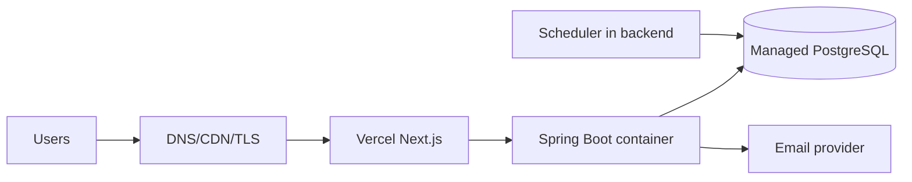

# Deployment Plan

## 1. Mục tiêu và topology khuyến nghị

Giải pháp MVP tiết kiệm: Next.js trên Vercel; Spring Boot container trên Render/Railway hoặc một VPS managed; managed PostgreSQL cùng region gần Việt Nam; email transactional provider. Không dùng Kubernetes.

Cookie cùng-site dễ nhất khi dùng `app.school.edu.vn` và `api.school.edu.vn`; CORS/CSRF vẫn cấu hình explicit. Region và data residency là **OPEN QUESTION**.

## 2. Environments

| Env | Mục đích | Data/đặc điểm |
|---|---|---|
| local | dev cá nhân | Docker PostgreSQL/Mailpit; fake accounts; `.env.local` ignored |
| development | tích hợp main | shared/ephemeral; auto deploy; synthetic data |
| staging | production-like/UAT | managed DB riêng, provider sandbox, same config shape, masked/synthetic data |
| production | người dùng thật | protected approvals, backup/monitoring/least privilege |

Không dùng chung DB/secret/email domain giữa environments. Preview deployment không được kết nối production.

## 3. Trade-off hạ tầng

| Lựa chọn backend | Ưu | Nhược | Khuyến nghị |
|---|---|---|---|
| Render/Railway | vận hành đơn giản, deploy container/health/log | sleep/cost/region/egress tùy gói; scheduler multi-instance cần kiểm tra | MVP nếu region/uptime phù hợp |
| VPS + Docker Compose | rẻ, kiểm soát, có thể đặt gần | trường phải patch OS, TLS, backup, monitoring | chỉ khi có người vận hành rõ |
| Major cloud managed container | reliability/IAM/scale | cấu hình và chi phí phức tạp hơn | production khi yêu cầu tăng |

Managed PostgreSQL ưu tiên automatic backup/PITR, TLS và connection limit rõ. Vercel thuận Next.js nhưng cần kiểm tra data transfer/cookie domain. Nếu muốn một nhà cung cấp, deploy cả frontend/backend container để giảm CORS và vận hành tài khoản.

## 4. Artifacts và configuration

- Frontend artifact immutable theo commit SHA; `NEXT_PUBLIC_API_BASE_URL` là public config duy nhất cần thiết.
- Backend multi-stage image chạy non-root, Java 21 JRE minimal, `/tmp` writable giới hạn; config externalized.
- Migration Flyway đóng trong backend artifact nhưng chạy bằng release job/credential riêng trước rollout, không để mọi instance tự race migrate production.

Environment variables (secret đánh dấu `*`):

| Variable | Ý nghĩa |
|---|---|
| `POSTGRES_DB`, `POSTGRES_USER`, `POSTGRES_PASSWORD*` | database và runtime credential dùng bởi production Compose |
| `PUBLIC_WEB_ORIGIN`, `PUBLIC_API_ORIGIN` | hai HTTPS origin chính xác, không có path/trailing slash |
| `SESSION_PEPPER*` | secret hash session/CSRF, tối thiểu 32 ký tự ngẫu nhiên |
| `SESSION_COOKIE_NAME` | production bắt buộc dùng prefix `__Host-`; secure cookie được Compose khóa `true` |
| `DB_POOL_MAX_SIZE`, `DB_POOL_MIN_IDLE`, `DB_CONNECTION_TIMEOUT_MS` | Hikari pool và fail-fast timeout |
| `AUTH_RATE_LIMIT_PER_MINUTE`, `AUTH_RATE_LIMIT_PER_HOUR` | baseline limiter đăng nhập/đăng ký |
| `SCHOOL_TIME_ZONE` | mặc định `Asia/Ho_Chi_Minh` |
| `EMAIL_FROM`, `SMTP_HOST`, `SMTP_PORT`, `SMTP_USERNAME`, `SMTP_PASSWORD*` | SMTP production; auth/STARTTLS được Compose khóa `true` |
| `FRONTEND_PORT`, `BACKEND_PORT` | loopback port tùy chọn cho reverse proxy TLS |

Credential bootstrap Admin không nằm trong `.env.production`. Chúng chỉ được inject từ secret manager vào one-shot provisioning container bằng `BOOTSTRAP_ADMIN_*`; `APP_PROVISIONING_MODE=true` và `BOOTSTRAP_ADMIN_ENABLED=true` phải xuất hiện cùng nhau. Startup production thông thường khóa cả hai về `false`.

Secret lưu trong platform secret store, rotate có runbook; không in trong build logs hoặc client bundle.

Bootstrap Admin không nằm trong Flyway và không tự cập nhật mật khẩu của Admin đã tồn tại. Chỉ bật ở một lần khởi động có kiểm soát, xác nhận audit `ADMIN_BOOTSTRAPPED`, sau đó xóa password khỏi secret scope và đặt `BOOTSTRAP_ADMIN_ENABLED=false` trước rollout thông thường.

## 5. CI pipeline

1. Checkout locked dependencies; lint/format/typecheck.
2. Backend unit + Testcontainers integration/migration; frontend component.
3. API/security tests; SAST/SCA/secret scan; SBOM.
4. Build frontend và backend image once; image vulnerability scan.
5. E2E trên ephemeral/development.
6. Push immutable signed/digest artifact; lưu test/report/migration checksum.

Protected main, review bắt buộc, CI identity least privilege. High/critical vulnerability và critical flow failure chặn release.

## 6. Deployment pipeline

Development auto deploy từ main. Staging promote chính artifact, chạy migration dry-run/check, deploy backend, frontend, smoke/E2E/UAT. Production cần approval:

1. Xác nhận backup/PITR healthy, change window, rollback owner.
2. Scale/stop worker cũ nếu migration cần; chạy Flyway bằng release job.
3. Deploy backend rolling/single-instance restart theo host; readiness rồi nhận traffic.
4. Deploy frontend compatible.
5. Verify health, login, current plan read, notification, scheduler lock; gửi synthetic email có kiểm soát.
6. Monitor error/latency/outbox 30–60 phút; ghi release audit.

Schema change phải backward-compatible theo expand–migrate–contract. Contract phase chỉ ở release sau khi code cũ không còn.

## 7. Scheduler và email production

Một backend instance có scheduler enabled ở MVP; mọi job vẫn dùng DB claim/idempotency. Khi scale nhiều instance, tất cả có thể poll với `SKIP LOCKED`, còn cron Saturday được bảo vệ bởi `scheduler_job_runs`. Không dựa vào local filesystem/time; NTP và timezone config explicit.

Email provider có verified domain/SPF/DKIM/DMARC, sandbox staging, quota/alert. Outbox dashboard theo backlog age, attempts, failed count. Manual retry là thao tác Admin vận hành có audit, không sửa DB trực tiếp.

## 8. Health, logs, monitoring và alerts

- Liveness: process/event loop; readiness: DB connection + Flyway version; email provider không làm backend unready.
- Metrics: HTTP p50/p95/error, JVM heap/GC, CPU, DB pool/slow query, session/login failures, outbox backlog/oldest age, reminder lag/fail, Saturday last run, email outcome.
- Structured logs tập trung, retention theo policy, correlation ID; redaction theo security design.
- Alerts: service unavailable 5 phút, error rate >5%, DB/storage threshold, oldest outbox >10 phút, reminder lag >5 phút, Saturday job missing 15 phút sau slot, backup failed.

**ASSUMPTION:** on-call trong giờ hành chính và escalation cho Sev-1 ngoài giờ; cần trường phê duyệt.

## 9. Backup, recovery và rollback

DB backup tự động hằng ngày, PITR nếu ngân sách cho phép; RPO 24h/RTO 4h tối thiểu. Backup encrypted, access tách runtime, restore drill staging hàng quý và checksum/sample business verification. Lưu cấu hình/IaC và artifact để tái tạo application; file export không cần backup vì tái sinh được.

Application rollback: chuyển traffic/redeploy digest trước. Nếu migration additive, code cũ vẫn chạy. Không down-migrate destructive tự động. Nếu lỗi dữ liệu: ngừng write/worker, snapshot, đánh giá forward-fix hoặc PITR; restore sang DB mới trước khi cutover. Ghi rõ mất dữ liệu theo RPO và kiểm notification/email duplicate sau recovery.

## 10. Initial production checklist

- [ ] OPEN QUESTION security/provider/retention/Excel được chốt hoặc risk accepted.
- [ ] DNS/TLS, CORS/CSRF/cookie/HSTS/CSP kiểm tra.
- [ ] Bootstrap Admin một lần, MFA decision, bootstrap path disabled.
- [ ] Department/BusinessRole seed và AcademicYear đầu được xác nhận.
- [ ] Production secrets mới, rotation/revocation test; không có dev secret.
- [ ] Flyway checksum, indexes và connection pool reviewed.
- [ ] SPF/DKIM/DMARC, sender, quota và email template UAT.
- [ ] Backup/PITR/restore drill đạt RPO/RTO.
- [ ] Dashboards/alerts/runbooks/on-call owner hoạt động.
- [ ] Critical flows, performance smoke, security scan/UAT pass.
- [ ] Excel với mẫu dữ liệu tiếng Việt được Hiệu trưởng duyệt.
- [ ] Privacy/retention/access policy và training Admin/User hoàn tất.

## 11. OPEN QUESTIONS

1. Domain/DNS, provider/region và ngân sách tháng?
2. Số User, peak concurrency và yêu cầu uptime thực tế?
3. Provider email, quota và domain nhà trường có quyền cấu hình DNS?
4. Retention/PITR và nơi lưu backup ngoài provider?
5. Ai on-call, ai có quyền production/DB, thời gian bảo trì cho phép?

## 12. Local baseline (2026-08-19)

Sao chép `.env.example` thành `.env` và thay secret khi dùng ngoài máy cá nhân. `docker compose up -d postgres` chạy PostgreSQL 18 tại `localhost:5433`; backend đọc `DB_URL`, `DB_USER`, `DB_PASSWORD` và tự chạy Flyway. Port 5433 tránh xung đột PostgreSQL cài trực tiếp tại 5432. Không dùng credential mẫu trong staging/production.
