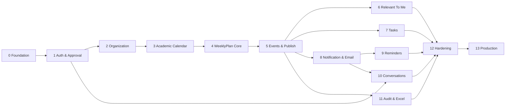

# Project Roadmap — MVP đến Production

Không ước lượng ngày khi chưa có velocity. Complexity tương đối gồm development, migration, test và review: S/M/L/XL. Mỗi phase chỉ hoàn tất khi acceptance criteria và tài liệu/observability liên quan cùng hoàn tất.

## Dependency map

## Phase 0 — Foundation (M)

- **Goal:** executable skeleton và guardrails kiến trúc.
- **Deliverables:** monorepo/project structure; ADR-001..005; Spring Boot/Next.js; PostgreSQL/Flyway; error envelope; Clock/UUID; lint/test/build; local Docker; CI/security scans.
- **Dependencies:** quyết định stack (đã ASSUMPTION khi repo trống).
- **Acceptance:** local one-command startup; migration empty DB; sample secured health path; CI xanh; secret không commit.
- **Risks:** over-abstraction sớm; môi trường Windows/Linux lệch. Giảm bằng vertical slice nhỏ và container CI.

## Phase 1 — Authentication & User Approval (XL) — PASS 2026-08-19

- **Goal:** vòng đời User an toàn và cơ cấu trường.
- **Deliverables:** register/login/logout; secure session/CSRF/rate limit; pending approval/status; lookup Department/BusinessRole/Class; protected BusinessRole seed; Admin bootstrap; audit nền. Password reset được deferred theo scope plan; CRUD organization thuộc Phase 2.
- **Dependencies:** P0; chốt password/MFA tối thiểu trước production.
- **Acceptance:** CF-01 pass; authorization/IDOR matrix; one Department/User, multi-role, unique GVCN/Admin constraints.
- **Risks:** self-elevation/session không revoke; email reset chưa có provider. Dùng fake provider + security tests.

## Phase 2 — Organization & SchoolClass (L) — PASS 2026-08-19

- **Goal:** hoàn thiện dữ liệu cơ cấu dùng bởi approval và các target phía sau.
- **Deliverables:** CRUD Department/BusinessRole; protected-role policy; SchoolClass theo AcademicYear và phân công GVCN an toàn.
- **Dependencies:** P1 authenticated Admin và approval contracts.
- **Acceptance:** organization E2E, unique normalized names, active/reference rules và unique GVCN.
- **Risks:** deactivate resource đang được tham chiếu; dùng conflict policy, optimistic lock và audit.

## Phase 3 — Academic Calendar (M) — PASS 2026-08-19

- **Goal:** mô hình năm và tuần có thể điều chỉnh.
- **Deliverables:** AcademicYear CRUD cần thiết; generator 39 weeks; edit independent dates; class-year integration.
- **Dependencies:** P1–P2.
- **Acceptance:** CF-02; sequence/display/type đúng; invalid dates/duplicate generation bị chặn.
- **Risks:** overlap đã chốt là warning; class-year được bảo vệ khi deactivate.

## Phase 4 — WeeklyPlan Core (XL) — PASS 2026-08-19

- **Goal:** Admin lập/copy nội dung nền trong block editor.
- **Deliverables:** DRAFT aggregate; đúng 5 PlanSection; targets; DaySession; duty classes; full editor/optimistic lock; copy previous.
- **Dependencies:** P3; Organization lookups từ P2.
- **Acceptance:** BR-015..018,021,022 tests; CF-03/04 phần DRAFT; copy không mang entity cấm; editor accessible.
- **Risks:** full-save payload/conflict và week length khác; versioning + ordinal copy warning.

## Phase 5 — Events & Publishing (XL) — PASS 2026-08-19

- **Goal:** hoàn thiện lịch, validation, công bố và sửa published plan.
- **Deliverables:** Event CRUD/multi-day display; validation error/warning; publish/outbox hook; User plan view; update confirm 4 choices.
- **Dependencies:** P4, outbox base P0.
- **Acceptance:** CF-04/05/06; DRAFT không leak; published metadata/audit atomic; no implicit notification.
- **Risks:** publish race/fan-out; idempotency, transaction tests và async recipients.

## Phase 6 — Relevant To Me & Dashboards (L) — PASS 2026-08-19

- **Goal:** User thấy đúng nội dung ưu tiên; Admin dashboard hành động.
- **Deliverables:** matching BR-027; dedup/matchedBy; Current Week/Today/full plan; Admin needs-attention/quick actions.
- **Dependencies:** P5, P1/P2.
- **Acceptance:** relevant dataset bao phủ ALL/ROLE/DEPARTMENT/USER/HOMEROOM; query performance; dashboard priority đúng SRS.
- **Risks:** N+1/khớp sai role inactive; projection query + integration/performance test.

## Phase 7 — Tasks (M) — PASS 2026-08-19

- **Goal:** giao, hoàn thành và thống kê nhiệm vụ.
- **Deliverables:** Admin Task CRUD/summary; User own list/complete; derived OVERDUE; notification event hook.
- **Dependencies:** P5; P8 có thể nhận event sau bằng outbox consumer.
- **Acceptance:** CF-09; ownership/clock boundary; no persisted OVERDUE.
- **Risks:** timezone/lost update; server Clock + optimistic lock.

## Phase 8 — Notifications & Email (XL) — PASS 2026-08-19

- **Goal:** Notification Center có tracking và email đáng tin cậy.
- **Deliverables:** Notification/recipient; unread/mark; domain event handlers cho publish/update/task/duty/message; transactional outbox; email templates/provider/retry/metrics.
- **Dependencies:** P5; hooks từ P7/P10.
- **Acceptance:** CF-07/08; statistics đúng; retry idempotent; provider failure không rollback publish.
- **Risks:** spam/duplicate/quota; dedup key, rate cap, broadcast confirm, alerts.

## Phase 9 — Reminders (L) — PASS 2026-08-19

- **Goal:** personal/Admin Event reminder và Saturday reminder.
- **Deliverables:** preset/custom; source ownership; worker claim/lease/retry; cron 08/17 timezone; job run idempotency.
- **Dependencies:** P5 Event, P8 email.
- **Acceptance:** CF-10/11; two-worker concurrency; skip published; Admin reminder không bị User xóa.
- **Risks:** duplicate/delayed email và Event time changes; fake Clock, outbox, UAT policy.

## Phase 10 — Conversations (L) — PASS 2026-08-19

- **Goal:** trao đổi nhiều lượt không realtime.
- **Deliverables:** open/list/detail/cursor messages/reply/close; creator/Admin ownership; notification integration; UI polling.
- **Dependencies:** P1; P8 cho notification (có thể develop contract song song).
- **Acceptance:** CF-12; User khác không enumerate; closed immutable; polling không duplicate.
- **Risks:** abuse/content; size/rate limit/plain-text escaping.

## Phase 11 — Audit & Excel Export (L) — PASS 2026-08-19

- **Goal:** truy vết đầy đủ và đầu ra văn bản nhà trường.
- **Deliverables:** audit query UI/filter/redaction; rà coverage action; Apache POI formatter; title/5 sections/day table/DRAFT watermark; formula-injection protection; extension ports VBA/PDF.
- **Dependencies:** P5 và mutation modules; mẫu Excel UAT.
- **Acceptance:** CF-13/14; Vietnamese Unicode; Admin-only; audit append-only; export memory bounded.
- **Risks:** mẫu chính thức chưa có, dữ liệu dài/merge/print; fixture worst case + stakeholder sign-off.

## Phase 12 — Testing & Hardening (XL) — READY FOR STAGING 2026-08-19

- **Goal:** release candidate đạt functional/NFR/security/operations.
- **Deliverables:** complete traceability FR↔UC↔BR↔API↔tests; Playwright critical flows; concurrency/performance/DAST/accessibility; logging/metrics/alerts; backup/restore; runbooks; dependency remediation.
- **Dependencies:** P6..P11.
- **Acceptance:** exit criteria [testing-strategy.md](testing-strategy.md); no Sev-1/2; NFR gates; restore/rollback rehearsal.
- **Risks:** hardening dồn cuối. Mỗi phase vẫn phải có automated tests; P11 là system validation, không phải lúc bắt đầu test.

## Phase 13 — Production Deployment (L)

- **Goal:** go-live có kiểm soát và bàn giao.
- **Deliverables:** production infra/DNS/TLS/secrets; migration/deployment; initial data/Admin; monitoring/on-call; UAT sign-off; training/runbook; post-deploy verification.
- **Dependencies:** P12 và OPEN QUESTION critical được chốt/risk accepted.
- **Acceptance:** production checklist đầy đủ; smoke/email/scheduler/backup healthy; release audit; rollback owner sẵn sàng.
- **Risks:** DNS/provider/ownership vận hành; rehearsal staging và change window.

## Sau MVP (không nằm trong commitment hiện tại)

- PersonalCalendar + reminder + conflict detection (không tự chỉnh lịch).
- Search WeeklyPlan/Event/Task/Notification/Conversation.
- Week-date shift preview/confirm.
- Mẫu Excel nâng cao, VBA Print Preview/PDF/Navigation.
- MFA, analytics hoặc tách service chỉ dựa trên rủi ro/đo tải đã có.

## Release governance

Definition of Done mỗi item: acceptance test, authorization, audit/notification impact, migration, observability, docs/API contract và rollback consideration. Scope change cần cập nhật trước `requirements.md` và business rule, rồi lan sang use case/API/DB/test/roadmap; không thêm nghiệp vụ trực tiếp từ implementation.

## Trạng thái triển khai

- 2026-08-19: Phase 0 foundation **PASS**; xem `phase-reports/phase-0.md`.
- 2026-08-19: Phase 1 authentication/session và user approval **PASS**; xem `phase-reports/phase-1.md`.
- 2026-08-19: Phase 2 organization CRUD và SchoolClass/GVCN **PASS**; xem `phase-reports/phase-2.md`.
- 2026-08-19: Phase 3 AcademicYear/SchoolWeek và generator 39 tuần **PASS**; xem `phase-reports/phase-3.md`.
- 2026-08-19: Phase 4 WeeklyPlan DRAFT/create/copy/editor **PASS**; xem `phase-reports/phase-4.md`.
- 2026-08-19: Phase 5 Event CRUD/validation/publish/published update **PASS**; xem `phase-reports/phase-5.md`.
- 2026-08-19: Phase 6 Relevant To Me và Dashboard projections **PASS**; xem `phase-reports/phase-6.md`.
- 2026-08-19: Phase 7 Tasks/overdue/ownership **PASS**; xem `phase-reports/phase-7.md`.
- 2026-08-19: Phase 8 Notification recipients/read tracking/outbox/email **PASS**; xem `phase-reports/phase-8.md`.
- 2026-08-19: Phase 9 Event reminders/Saturday scheduler **PASS**; xem `phase-reports/phase-9.md`.
- 2026-08-19: Phase 10 Conversations/ownership/polling **PASS**; xem `phase-reports/phase-10.md`.
- 2026-08-19: Phase 11 Audit append-only/redaction và Excel export **PASS**; xem `phase-reports/phase-11.md`.
- 2026-08-19: Phase 12 repository hardening **READY FOR STAGING**; Playwright 11 PASS/1 intentionally skipped gồm onboarding/approval và chuỗi plan/publish/Excel/SMTP notification+reminder/task/conversation, k6 100 VU, ZAP passive 0 FAIL/WARN, production images và backup/restore rehearsal PASS. Dataset/write load, SMTP provider verification, active authenticated DAST và UAT cần staging thật; xem `phase-reports/phase-12.md`.
- 2026-08-20: Phase 13 repository preparation bổ sung CI timeout/failure diagnostics, bảo vệ `.env.production`, one-shot Admin provisioning có regression rehearsal idempotent trên PostgreSQL 18 và Blueprint Render cho API/PostgreSQL. Topology cloud đã chốt Vercel + Render với sibling custom domains để bảo toàn cookie `SameSite=Lax`. Phase 13 vẫn chưa PASS cho đến khi staging/production infrastructure và sign-off bên ngoài hoàn tất.
- Phase 13 chưa triển khai thật: cần DNS/TLS/SMTP production, secret manager, monitoring endpoint và UAT/sign-off của nhà trường.
