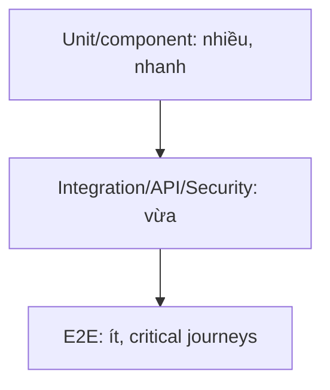

# Testing Strategy

## 1. Mục tiêu và test pyramid

Unit ~60%, integration/API ~30%, E2E ~10% theo số test (định hướng, không KPI cứng). Mọi bug production có regression test ở lớp thấp nhất tái hiện được.

Stack: JUnit 5, AssertJ, Mockito chỉ cho port; Spring Boot Test + MockMvc; Testcontainers PostgreSQL (không H2); WireMock/fake email provider; Vitest, Testing Library, MSW; Playwright. JaCoCo/coverage dùng làm tín hiệu, không thay review.

## 2. Test levels

| Level | Phạm vi | Ví dụ/gate |
|---|---|---|
| Unit | domain rule, mapper, date/reminder/overdue, validator | nhanh, deterministic; BR-011..036 |
| Repository | mapping, unique/check/index-aware query, locking | Testcontainers; migration thật |
| Integration | application service + DB + outbox/audit transaction | rollback, idempotency, optimistic conflict |
| API | envelope/status/validation/authz/pagination | MockMvc; contract snapshots có kiểm soát |
| Security | CSRF/CORS/cookie/headers/IDOR/rate/redaction | actor matrix, OWASP cases |
| Frontend component | AssignmentCard, targets, warning dialog, notification bell | accessible queries, no implementation detail |
| E2E | critical user journeys qua browser/API thật | Playwright trên staging-like |
| Scheduler/email | clock giả, claim/retry/dedup/cron timezone/template | không sleep; fake clock/provider |
| Concurrency | create plan, publish, complete, worker claim | 2 transaction/barrier; đúng một outcome |
| Performance smoke | dashboard/plan/list/publish fan-out/export | p95 NFR, không N+1, bounded memory |
| Regression | suite tag theo module/risk | chạy PR + nightly |

## 3. Critical flow suite

| ID | Flow | Assertions trọng yếu |
|---|---|---|
| CF-01 | Register → PENDING → Approve → Login | pending cannot login; Department required; cookie/CSRF; audit |
| CF-02 | Create AcademicYear → Generate Weeks | đúng 39; mapping 2+37; unique/independent dates |
| CF-03 | Copy WeeklyPlan | sections/targets/baseContent copied; Event/Task/reminder/notification/duty absent |
| CF-04 | DRAFT invisible to User | endpoint/dashboard/export/deep-link không leak; returns 404 |
| CF-05 | Publish visible | validation; status/metadata; all active recipients; outbox idempotent |
| CF-06 | Edit published | four website/email choices; no implicit send; version/audit |
| CF-07 | Notification tracking | recipient fan-out; unread count; one/all idempotent; stats 72/58/14-style |
| CF-08 | Duty class → GVCN | Relevant To Me highlight + one deduplicated notification |
| CF-09 | Assign Task → complete | owner only; completedAt; overdue derived by clock |
| CF-10 | Reminder scheduling | presets/absolute; ADMIN independent; claim/retry/no normal duplicate |
| CF-11 | Saturday reminder | Asia/Ho_Chi_Minh 08/17; skip published; one per slot; year boundary |
| CF-12 | Conversation open → messages → close | ownership, notify other side, closed rejects message |
| CF-13 | Excel export | Unicode, 5 sections, date/session/Event range, DRAFT watermark |
| CF-14 | Audit | old/new/actor/correlation, redaction, no update/delete, Admin only |
| CF-15 | Task attachment | Admin upload DOCX/PDF, retry riêng file lỗi, assignee list/download/complete, User khác direct URL `403`, Admin delete/audit |

## 4. Business-rule coverage

- BR-001..009: authorization/approval/tối đa hai Admin active/unique GVCN/soft deactivate repository+API tests.
- BR-010..014: generator property tests for valid start dates and uniqueness.
- BR-015..027: plan aggregate, copy, publish warning matrix, target combinations và Relevant dedup.
- BR-028..036: fake Clock boundary exactly due time, DST-independent school timezone, retry lease recovery.
- BR-037..042: ownership/state/audit/export snapshot.

Mỗi rule ID phải xuất hiện trong tên/display name hoặc test metadata để tạo traceability report.

## 5. Chi tiết test quan trọng

### Publish validation matrix

Test blocking error đơn/lẫn nhau; từng warning; nhiều warnings; `publishWithWarnings=false/true`; plan sửa giữa validate và publish; hai Admin request đồng thời (dù chỉ một account, double-tab); retry cùng/khác idempotency key. Verify commit plan+audit+outbox atomic.

### Relevant To Me

Dataset gồm User khớp ALL, nhiều role, department, direct target, task, homeroom duty và không khớp. Assert item một lần cùng `matchedBy` đầy đủ; inactive role/department policy; chỉ published plan.

### Scheduler/email

Inject `Clock`; không dùng `Thread.sleep`. Test exact before/at/after `remindAt`; lease expired; two workers `SKIP LOCKED`; transient/permanent errors; max retries; provider timeout; template escaping; recipient inactive. Saturday cases: Friday/Saturday/Sunday, 08:00/17:00, next week missing/draft/published, server UTC nhưng school timezone.

### Database

Chạy toàn bộ Flyway từ empty và upgrade từ bản release trước. Assert FK delete strategies, CHECKs, hai Admin slot duy nhất, partial unique GVCN, target polymorphic check, published metadata. Dùng `EXPLAIN` smoke cho notification feed, task overdue, plan load/Relevant query với dataset cỡ dự kiến.

### Frontend/E2E

Component tests: keyboard/focus/modal warning, unsaved/stale version error, screen reader labels, loading/empty/error. Playwright không phụ thuộc text dễ đổi nếu có role/label ổn định; seed qua API fixture, cleanup transaction/database namespace.

## 6. Security test matrix

Task attachment matrix bắt buộc: valid PDF/DOCX/Unicode; executable extension; MIME mismatch; fake signature; empty/oversize; file-count và total-size; unauthenticated/USER upload; Admin/assignee download; User khác list/direct download `403`; USER/Admin delete; CSRF; storage unavailable; DB metadata failure gọi compensating delete; local storage traversal/create/read/delete/missing object. Frontend test picker/extension/size/count/total; Playwright kiểm tra loading, partial failure, retry, list, download và visibility delete theo role.

Mỗi protected endpoint chạy: unauthenticated `401`; wrong role `403` hoặc hidden `404`; pending/inactive; CSRF missing/invalid; owner vs other User; malformed UUID/body; mass-assignment fields (`systemRole`, `createdBy`); SQL/XSS strings; oversized content; rate limit. Verify cookie flags/CORS/CSP và logs không chứa password/token.

DAST staging và manual review tập trung Admin endpoints, DRAFT enumeration, Conversation/Reminder/Notification IDOR, Excel formula injection. Mọi cell bắt đầu `=`, `+`, `-`, `@` từ user content phải được escape để ngăn formula injection.

## 7. Performance và reliability

Seed đề xuất: 1 academic year, 39 weeks, 500 Users, 50 classes, 5 sections/plan, 100 Events/plan, 10k notifications, 5k tasks. Smoke 100 concurrent users theo NFR-PERF-001; publish 500 recipients; export worst-case. Gates: p95, error <1%, DB pool không cạn, query count bounded, export memory không tăng theo file không giới hạn.

Chaos-lite staging: provider email timeout, worker restart sau claim, DB connection transient, duplicate scheduler tick. Verify business transaction không mất và backlog recover.

## Phase 1 automation evidence

- Unit: API envelope, password policy và auth rate-limit.
- Architecture: feature/shared dependency direction.
- Integration: Flyway V1 trên PostgreSQL sạch.
- Critical E2E/API: register → PENDING → login denied → Admin login → CSRF enforcement → approve → USER login/me → role denial → logout → inactive/revoke.
- Negative E2E: thiếu/malformed Origin/Referer, validation, duplicate email và unauthenticated Admin access.
- Browser Playwright harness được bổ sung ở Phase 12: stack cô lập dùng frontend production image, backend thật và PostgreSQL 18 `tmpfs`; baseline đăng nhập/session/route guard Admin chạy desktop/mobile. Critical business flow Phase 1 vẫn có coverage sâu qua HTTP/security/database thật bằng MockMvc + Testcontainers.

## 8. Naming, fixtures và CI

Backend: `method_condition_expectedResult`, ví dụ `publish_withWarningsConfirmed_persistsAndEnqueuesRecipients`; BDD display name có `[BR-024][FR-PLAN-008]`. Frontend: `Component.scenario.test.tsx`; E2E `cf-05-publish-visible.spec.ts`.

Fixture builders có default hợp lệ, override rõ; fixed UUID/time; không chia sẻ mutable state. Test data không dùng PII thật.

Pipeline:

1. PR: lint/typecheck/unit/component, migration check, integration/API/security slice, build, SCA/SAST/secret scan.
2. Main: full Testcontainers + E2E ephemeral + image scan.
3. Nightly: scheduler/concurrency/performance smoke/DAST.
4. Release: all critical flows, restore smoke, manual UAT Excel/editor/email.

Không merge khi critical/high security failure, migration failure, critical flow failure hoặc flaky retry vẫn fail. Flaky test bị quarantine có owner/ticket/deadline, không silently retry vô hạn.

## 9. UAT và exit criteria

UAT bởi Hiệu trưởng + đại diện giáo viên với dữ liệu giả lập: lập/copy/publish/sửa tuần, “Dành cho bạn”, task, reminder, conversation, Excel. MVP exit khi CF-01..14 pass, không defect Sev-1/2, NFR security/data gates pass, accessibility critical path không có serious issue, restore và rollback rehearsal thành công.

## 10. Phase 0 executable baseline

- Frontend gates: `npm run lint`, `npm run typecheck`, `npm run build`.
- Backend unit/architecture: `backend/mvnw.cmd test` trên Windows hoặc `./backend/mvnw test` trên Unix.
- Full backend gate: `backend/mvnw.cmd verify`; Failsafe chạy `CleanDatabaseMigrationIT` bằng PostgreSQL 18 Testcontainers và Flyway trên schema sạch.
- CI chạy cùng các gate trên Node.js 22 và Java 21. Máy phát triển cần Docker Engine cho integration test; không thay PostgreSQL bằng H2.

## 11. Phase 2 verification evidence (2026-08-19)

- Frontend: lint, TypeScript typecheck và production build PASS (22 routes).
- Backend: 5 unit/architecture tests và 4 integration tests PASS qua `mvn verify`.
- Integration coverage gồm migration V1→V2 trên database sạch, hồi quy Phase 1, Department/BusinessRole/Class/GVCN CRUD, duplicate normalization, optimistic conflict, protected role, CSRF, `401/403`, audit và ràng buộc GVCN.

## 12. Phase 3 verification evidence (2026-08-19)

- Frontend: lint, TypeScript typecheck và production build PASS (23 routes).
- Backend full gate: 5 unit/architecture tests và 5 integration tests PASS qua `mvn verify`.
- CF-02 coverage: sinh đúng 39 tuần, mapping 2 orientation + 37 study, date mặc định, duplicate generation, invalid name/date, one-active-year, class-year guard, optimistic conflict, overlap warning, audit, CSRF, `401/403` và migration V1→V3 sạch.

## 13. Phase 4 verification evidence (2026-08-19)

- Frontend: lint, TypeScript typecheck và production build PASS (23 routes).
- Backend full gate: 5 unit/architecture tests và 6 integration tests PASS qua `mvn verify` (tổng 11 tests, 0 failure/error).
- CF-03/CF-04 coverage: tạo đúng 5 section và 2 session/ngày, full-save target/lớp trực/baseContent, optimistic conflict, invalid aggregate, copy theo ordinal, idempotency key/retry, không copy Event/Task/Reminder/Notification/lớp trực, DRAFT trả 404 cho User, Admin authorization/CSRF, audit và migration sạch V1→V4.

## 14. Phase 5 verification evidence (2026-08-19)

- Frontend lint, typecheck và production build PASS (23 routes).
- Backend full gate PASS: 12 tests, 0 failure/error trên PostgreSQL 18 Testcontainers.
- CF-05/CF-06: Event invalid/multi-day, validation errors/warnings, publish key/version/warning confirmation, retry idempotent, metadata, outbox/audit atomic, DRAFT 404, danh sách User chỉ chứa PUBLISHED, current published visibility và published notification-choice guard.

## 15. Phase 6 verification evidence (2026-08-19)

- Frontend lint/typecheck/build PASS (23 routes); backend 13 tests PASS qua `mvn verify`.
- Relevant dataset phủ ROLE + DEPARTMENT đồng thời, dedup/matchedBy, HOMEROOM_CLASS và dashboard role isolation `403`; projections không còn dùng mock.

## 16. Phase 7 verification evidence (2026-08-19)

- Frontend lint/typecheck/build PASS (23 routes); backend 14 tests PASS qua `mvn verify`.
- CF-09 phủ active assignee, server-derived OVERDUE/summary, ownership/CSRF, complete idempotent, outbox và audit.

## 17. Phase 8 verification evidence (2026-08-19)

- Frontend lint/typecheck/build PASS (23 routes); backend 10 tests PASS qua focused clean `mvn verify` (5 unit/architecture + 5 integration).
- CF-07/08 phủ fan-out theo recipient, unread/mark-one/mark-all idempotent, IDOR hidden 404, outbox dedup/lease recovery, bounded retry đến `FAILED`, business transaction không rollback và frontend REST integration.
- Email có hai provider có điều kiện: `log` cho local/test và SMTP cho staging/production; metric `schedule.outbox.processed/failed` gắn loại event.

## 18. Phase 9 verification evidence (2026-08-19)

- Frontend lint/typecheck/build PASS (23 routes); backend full clean verify PASS với 11 tests (5 unit/architecture + 6 integration).
- CF-10 phủ preset/custom, thời điểm tương lai, ADMIN/USER độc lập, User không hủy reminder ADMIN, hủy idempotent theo state, due delivery và không gửi lặp ở lần drain kế.
- CF-11 phủ timezone `Asia/Ho_Chi_Minh`, job key một lần mỗi slot, plan đã publish thì `SKIPPED`, plan chưa publish thì enqueue đúng một website/email notification cho Admin.
- Integration dùng fixed `Clock`, không phụ thuộc ngày chạy máy.

## 19. Phase 10 verification evidence (2026-08-19)

- Frontend lint/typecheck/build PASS (23 routes); backend focused verify PASS với 12 tests tổng cộng.
- CF-12 phủ create thread + message đầu atomic, User khác nhận hidden 404 khi đọc/ghi, Admin/User trả lời nhiều lượt, optimistic close, close idempotent và CLOSED từ chối message mới.
- Bốn outbox event của flow được xử lý đúng một lần thành notification cho phía đối diện; audit đủ create/message/close.

## 20. Phase 11 verification evidence (2026-08-19)

- Frontend lint/typecheck/build PASS (23 routes); backend clean focused verify PASS với 13 tests tổng cộng.
- CF-13 mở workbook bằng Apache POI và kiểm tra A4 ngang/fit one page, DRAFT watermark, đủ 5 section, Unicode tiếng Việt, bảng ngày/sáng/chiều và prefix apostrophe chống formula injection.
- CF-14 kiểm tra Admin-only, filter, redaction secret và Flyway V5 trigger từ chối UPDATE/DELETE AuditLog.

## 21. Phase 12 repository hardening evidence (2026-08-19)

- Frontend lint/typecheck/production build PASS (23 dynamic routes với nonce CSP), Playwright + axe 11 PASS/1 intentionally skipped: full business chain chạy một lần trên desktop, smoke auth/onboarding/accessibility chạy desktop/mobile; npm audit 0 vulnerability.
- Authenticated baseline chạy trên production frontend image + backend/PostgreSQL/Mailpit thật: Admin/session/route guard, CF-01 onboarding và full chain plan/publish/Excel/SMTP notification+reminder/task/conversation PASS; Mailpit kiểm tra subject, recipient và HTML template có nhận diện/CTA; axe không còn serious/critical tại các checkpoint.
- k6 authenticated-read baseline re-run chạy 100 session/100 VU trong 30 giây: 20.457 request, p95 323,72 ms, 0% lỗi; CI giữ ngưỡng p95 `<500 ms`, lỗi `<1%`, checks `>99%`. Đây không thay thế staging dataset và API write gate.
- OWASP ZAP passive baseline dùng image pin digest và policy-as-code: 0 FAIL, 0 WARN, 65 PASS; `X-Powered-By`, CSP unsafe-inline và COEP là regression FAIL. Active/authenticated scan vẫn chạy trên HTTPS staging.
- Backend full clean `mvn verify` PASS: 21 tests, 0 failure/error; clean Flyway V1→V5 trên PostgreSQL 18.
- Frontend/backend production images build PASS và chạy non-root; compose production startup `--wait`, readiness, frontend headers PASS.
- Backup custom-format, destructive restore trên stack smoke cô lập và post-restore readiness đều PASS; toàn bộ temporary container/network/volume/file rehearsal đã được dọn.
- Local read smoke 100 VU PASS lại sau hardening: 20.457 authenticated reads, p95 323,72 ms, 0% lỗi; SMTP application delivery path PASS qua Mailpit. Chưa tuyên bố dataset/write performance, active DAST, SMTP provider/TLS/quota hay UAT PASS vì cần staging có topology và actor thật.
